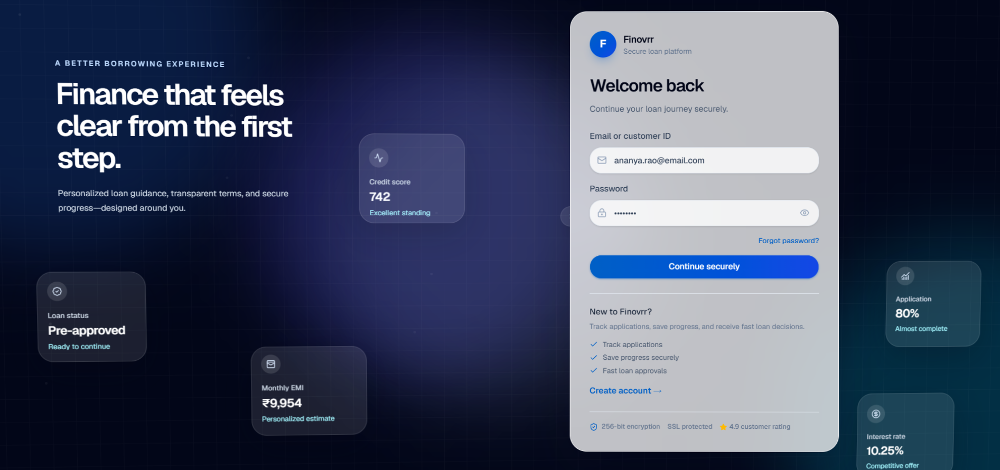
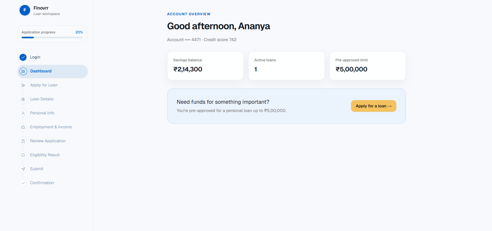
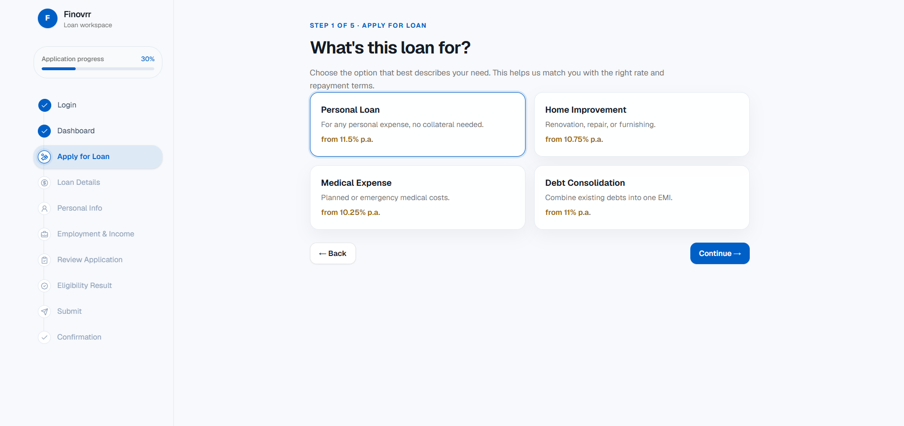
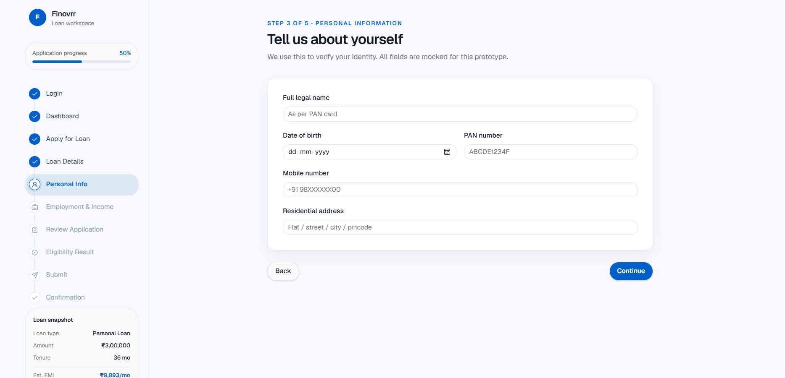
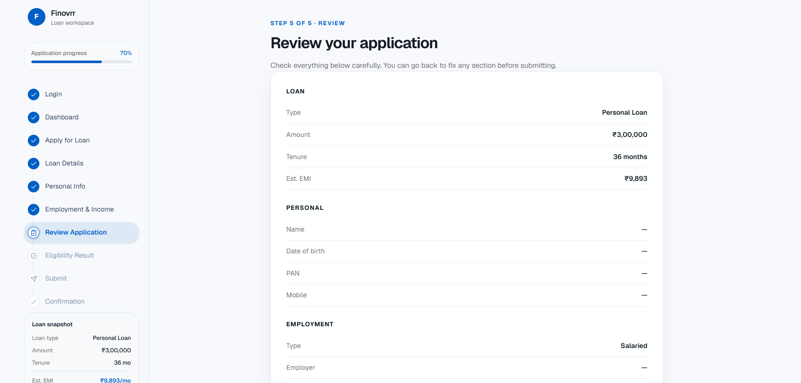
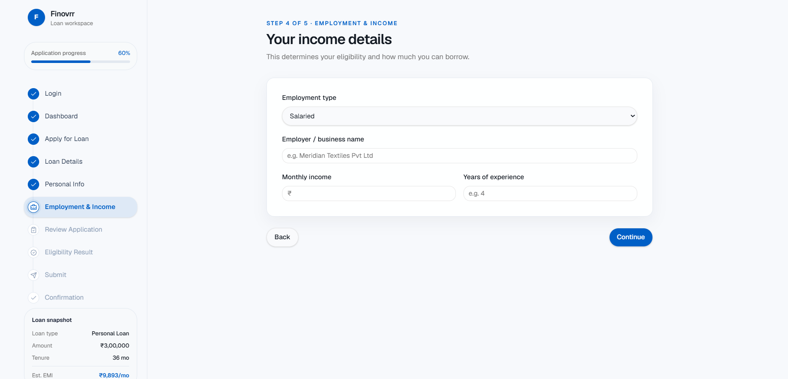
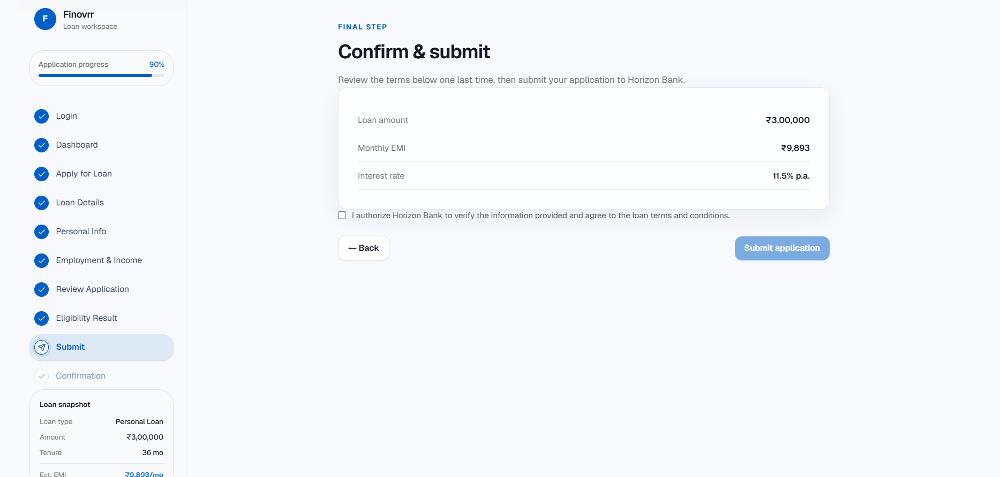
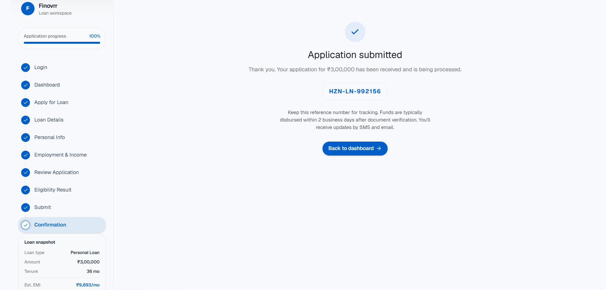
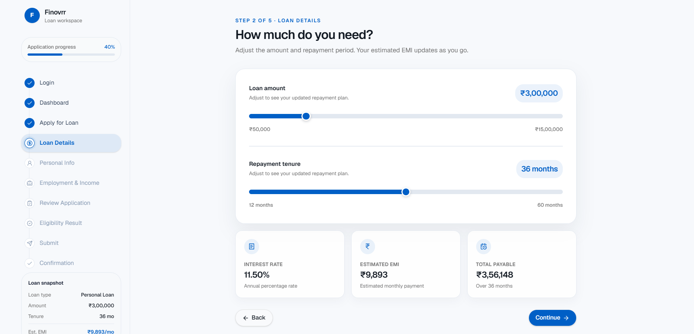
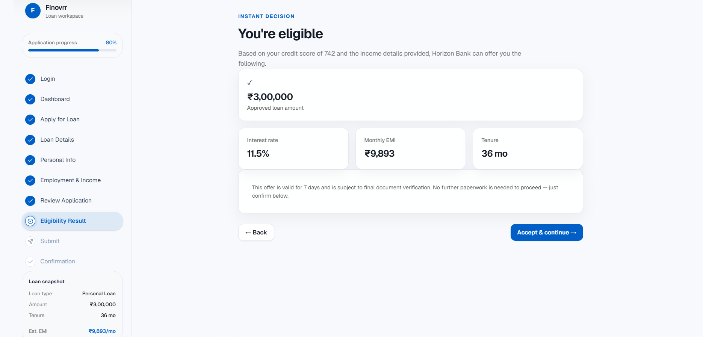

# Personal Loan Application Prototype

A clickable front-end prototype of a retail bank's personal loan application journey, built for the Finovrr Product Engineer Assessment (Part 1).

**Live customer journey (10 screens):**
Login → Dashboard → Apply for Loan → Loan Details → Personal Info → Employment & Income → Review Application → Eligibility Result → Submit → Confirmation

## Demo

**GitHub Repository:**  
https://github.com/Karthikkkr1085/Product-Engineer-Assessment-Submission

> The application is a frontend-only prototype built for the Finovrr Product Engineer Assessment.


## Design concept — "The Running Ledger"

Instead of a generic step wizard, the prototype frames the application as a bank ledger being filled in real time. A persistent left rail tracks progress step-by-step, and from the moment loan details are entered, a live "ledger strip" at the bottom of the rail shows the loan type, amount, tenure, and estimated EMI updating instantly — so the applicant always sees the running cost of their decision, the way a banker would.

- **Type:** Source Serif 4 (headings) + Inter (body) + IBM Plex Mono (all monetary figures, tabular numerals) — numbers read like a statement, not UI chrome.
- **Color:** deep navy ink, cool paper background, a muted brass accent for primary actions and approvals, emerald for the eligibility decision.
- **No backend, database, APIs, or real authentication** — all data is mocked in `src/data/mockData.js` and application state is held in React Context (`src/context/ApplicationContext.jsx`) for the duration of the session only.

## Tech Stack

| Category | Technologies |
|----------|--------------|
| Frontend | React 18, Vite |
| Routing | React Router DOM |
| Styling | Tailwind CSS v4, CSS3 |
| UI Components | shadcn/ui |
| Animations | Framer Motion |
| Icons | Lucide React |
| State Management | React Context API |
| Language | JavaScript (ES6+) |
| Build Tool | Vite |

## Features

- Premium fintech-inspired UI
- Responsive design for desktop and mobile
- Glassmorphism visual design
- Smooth page transitions with Framer Motion
- Animated dashboard metrics
- Multi-step loan application journey
- Dynamic EMI calculation
- Live application progress tracking
- Accessible UI components
- Reusable component architecture
- Mock authentication flow
- In-memory state management with React Context


## Project Structure

```
src/
├── components/
│   ├── auth/
│   ├── dashboard/
│   ├── layout/
│   ├── loan/
│   ├── motion/
│   ├── shared/
│   └── ui/
├── context/
├── data/
├── lib/
├── pages/
├── styles/
└── utils/
```

## Running Locally

### Clone the repository

```bash
git clone https://github.com/Karthikkkr1085/Product-Engineer-Assessment-Submission.git
cd Product-Engineer-Assessment-Submission
```

### Install dependencies

```bash
npm install
```

### Start the development server

```bash
npm run dev
```

Open your browser and visit:

```
http://localhost:5173
```
## Production Build

Build the application:

```bash
npm run build
```

Preview the production build:

```bash
npm run preview
```
## Screenshots

| Login | Dashboard |
|-------|-----------|
|  |  |

| Loan Details | Personal Information |
|--------------|----------------------|
|  |  |

| Review | Eligibility |
|--------|-------------|
|  |  |

| Submit | Confirmation |
|--------|--------------|
|  |  |

| Loan Amount | Eligibility Result |
|-------------|--------------------|
|  |  |


## Notes

- Frontend prototype only (no backend integration).
- Authentication is mocked for demonstration.
- Loan calculations are simulated for UI purposes.
- Application state is maintained using React Context.
- Built as part of the Finovrr Product Engineer Assessment.
